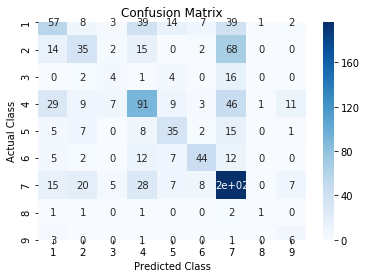
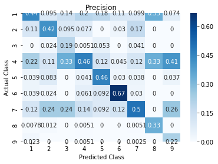
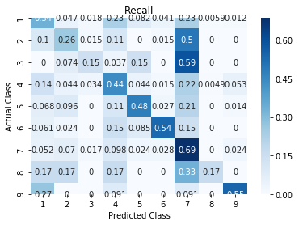

# Multi-class classification of Gene-Mutation for personalized cancer treatment

## Table of contents: 

<a href='#intro'> 1. Brief introduction to gene, gene mutation and personalized cancer treatment</a>  
<a href='#obj'> 2. Machine learning model objective and performance metric</a> 
<a href='#approach'> 3. Approach </a> 
&nbsp;&nbsp;&nbsp;<a href='#data'> 3.1 Data</a> 
&nbsp;&nbsp;&nbsp;<a href='#cat'> 3.2 Feature Engineering: Categorical features</a> 
&nbsp;&nbsp;&nbsp;<a href='#text'> 3.3 Feature Engineering: Text feature</a> 
<a href='#final_model'> 4. Finalized model and its performance</a> 
<a href='#interpret'> 5. Model Interpretation</a> 
<a href='#next_steps'> 6. Next steps </a> 

## 1. Brief introduction to gene, gene mutation and personalized cancer treatment

**Gene:** Gene is a region of DNA which contains sequence of nucleotides (for now, just think of it as sequence of letters like CATCATCATCATCAT). 

**Gene Mutation:** Gene Mutation is the change to a particular gene. There can be different types of changes/variation that can happen to a gene, For example: substitution(as shown in the fig below from [source](https://www.yourgenome.org/facts/what-types-of-mutation-are-there)), insertion, etc. 

**Personalized cancer treatment:** A cancer patient can have thousands of gene mutations. Depending on the type of mutation in a gene, the mutated gene can create adversial (cancer driver) or neutral (passenger) effect in humans. Personalized cancer treatment is a custom-tailored cancer treatment that is developed based on the gene, mutation observed and its type in a patient. 

**Why classify?** Identifying the type of gene mutation is one of the precursors in developing personalized cancer treatment. There are 9 types of gene mutations: varying levels of passenger and driver mutation. 

## 2. Machine learning model objective and performance metric

The objective is to classify every gene-mutation pair into one of 9 types based on clinical evidence (unstructured text data from medical research journal article). Log loss will be used as the model performance metric. 

## 3. Approach: 

## 3.1 Data: 
The dataset contains two categorical variables: Gene and Variation; and a text feature containing unstructured text from medical research journal article. Variation is nothing but the mutated gene. 

## 3.2 Feature engineering:

## Categorical Features:
    One hot encoded
    Target encoded

## Text Features: The preprocessing and processing steps followed are as follows:

### Preprocessing:
	1. Removal of reference to figures/tables (for eg., Figure 2a, fig3, tab 2.1, table1)
	2. Removal of references to other research articles (for eg., [4,5], (3-8), [5])
	3. Removal of weblink
	4. Change to lower case
	5. Lemmatization
	6. Stop words: Two kinds of stop words were removed: 
		(a) English stop words and 
		(b) Stop words in peer-reviewed scientific journal articles (manually curated, eg. demonstrated, studied, showed, etc) 	

### Processing:
	Tokenization and word2Vec using SciSpacy (NLP package for processing biomedical and clinical literature).
 
	Model used: en_core_sci_sm
	word2vec: 96 dimensions

## 4. Finalized model and its performance 

    Target encoded categorical features + 
    Scispacy processed text + 
    TFIDF weighted word2vec —> Multinomial Naive Bayes 
    —> Log loss of 1.63
 **Confusion Matrix**   
 
 
  
	
 **Precision** 
 
 
  
	
 **Recall**
 

    Average precision: 
    Average recall:
    F1 score: 

## 5. Interpretation:

The following table shows the top 20 words for every gene-mutation class type. When a medical literature has these words, they have the high probability to be classified into that class type.

## 6. How to improve the model performance? 

I think the next step towards performance improvement is feature engineering of text data. It is very crucial to have domain knowledge to perform further feature engineering that can improve the model performance.
